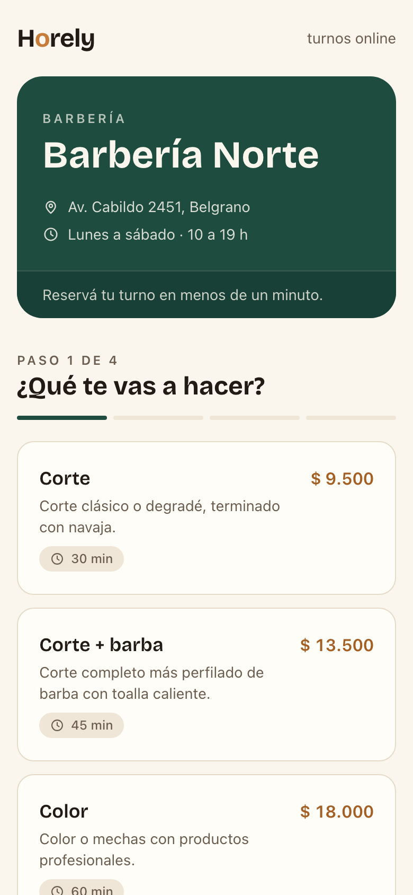
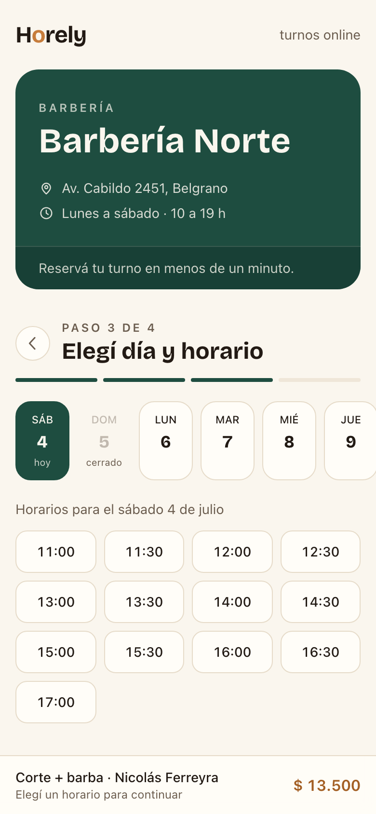
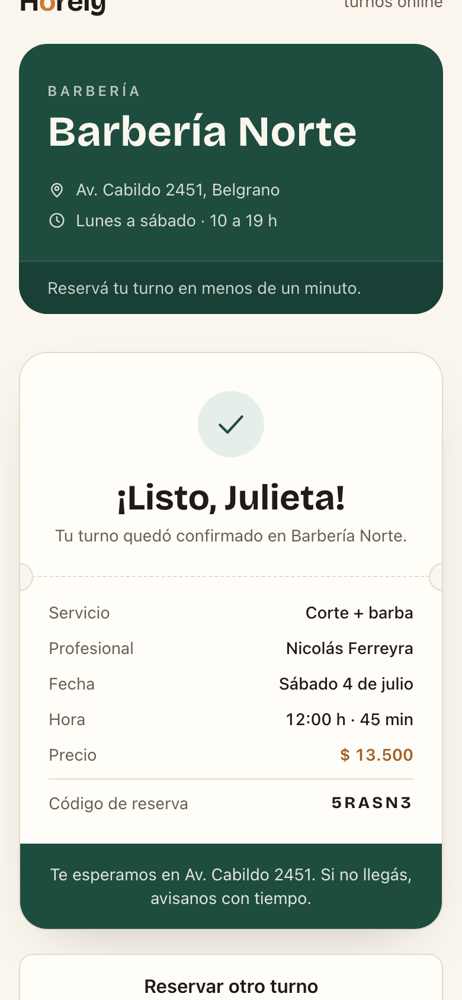
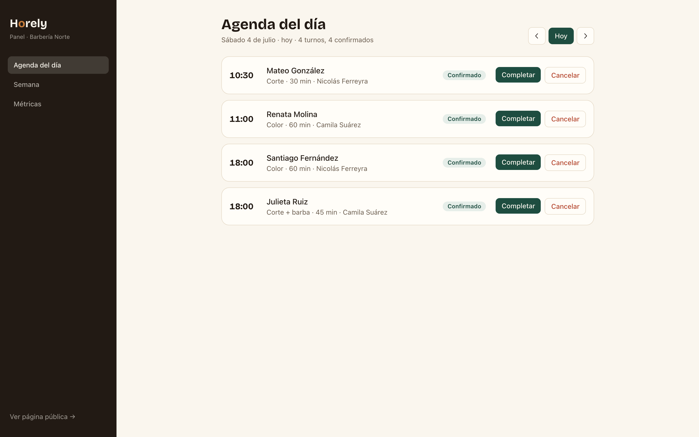
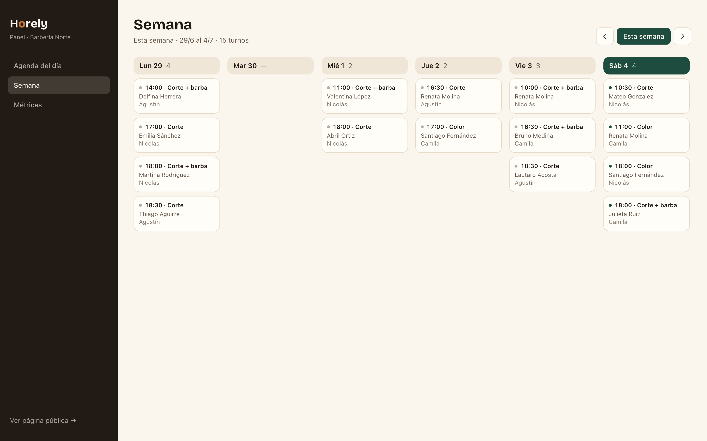
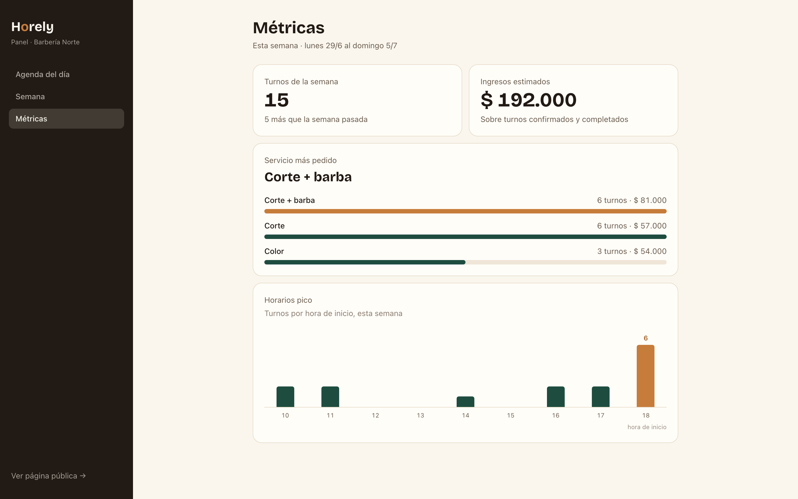

# Horely

Plataforma de reserva de turnos online. El demo incluye un negocio de ejemplo
(**Barbería Norte**) con dos caras:

- **Vista pública** (`/`): el cliente elige servicio, profesional, día y horario
  en un calendario semanal, deja sus datos y recibe un ticket de confirmación.
  Diseñada mobile-first, porque la mayoría reserva desde el celular.
- **Panel de administración** (`/admin`): agenda del día y de la semana, con
  acciones para marcar turnos como completados o cancelados, y métricas simples
  (turnos de la semana, servicio más pedido, horarios pico).

> Demo sin autenticación ni pagos: `/admin` entra directo y los turnos se
> abonan en el local.

## Capturas

### Vista pública de reserva (mobile)

| Elegir servicio | Día y horario | Ticket de confirmación |
| :---: | :---: | :---: |
|  |  |  |

### Panel de administración

**Agenda del día**, con acciones para completar o cancelar turnos:



**Vista semanal**:



**Métricas** de la semana — turnos, ingresos estimados, servicio más pedido y horarios pico:



## Stack

- [Next.js](https://nextjs.org/) (App Router) + TypeScript
- [Tailwind CSS v4](https://tailwindcss.com/)
- [Prisma](https://www.prisma.io/) + SQLite
- Server Actions para reservas y cambios de estado, sin librerías de UI

## Cómo correrlo localmente

Requisitos: Node.js 20 o superior.

```bash
# 1. Instalar dependencias
npm install

# 2. Configurar variables de entorno
cp .env.example .env

# 3. Crear la base SQLite y cargar datos de ejemplo
#    (3 profesionales, 3 servicios y ~40 turnos entre la semana pasada y la próxima)
npm run db:setup

# 4. Levantar el servidor de desarrollo
npm run dev
```

Abrí [http://localhost:3000](http://localhost:3000) para la vista pública y
[http://localhost:3000/admin](http://localhost:3000/admin) para el panel.

Para volver a generar los datos de ejemplo en cualquier momento:

```bash
npm run db:seed
```

El seed genera los turnos en fechas relativas a hoy, así la agenda siempre se
ve poblada.

## Estructura

```
app/
  page.tsx              # Vista pública de reserva
  actions.ts            # Server actions: crear reserva, cambiar estado
  api/slots/            # Disponibilidad de horarios
  admin/                # Agenda del día, semana y métricas
components/
  booking/              # Flujo de reserva y ticket de confirmación
  admin/                # Navegación y badges del panel
lib/
  availability.ts       # Lógica de horarios libres
  format.ts             # Fechas y moneda en es-AR
prisma/
  schema.prisma         # Professional, Service, Appointment
  seed.ts               # Datos de ejemplo
```
